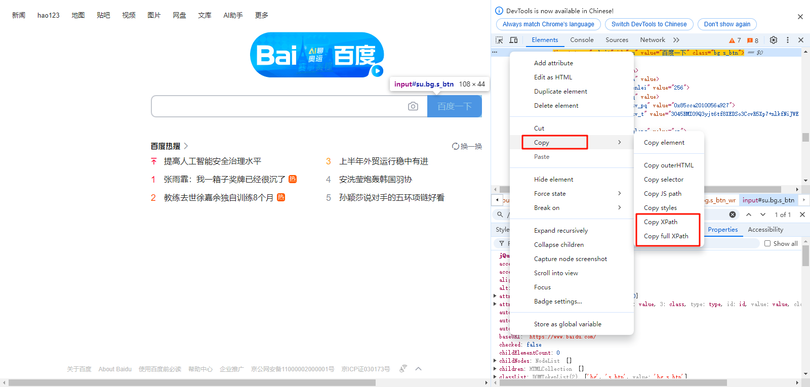
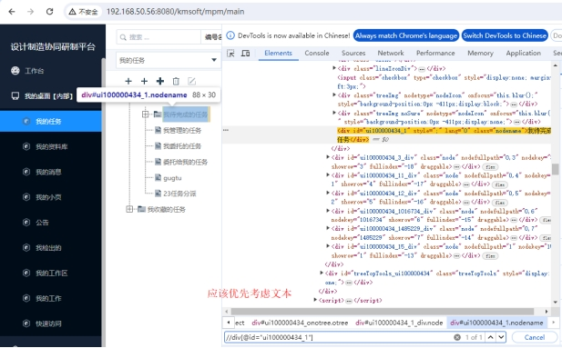
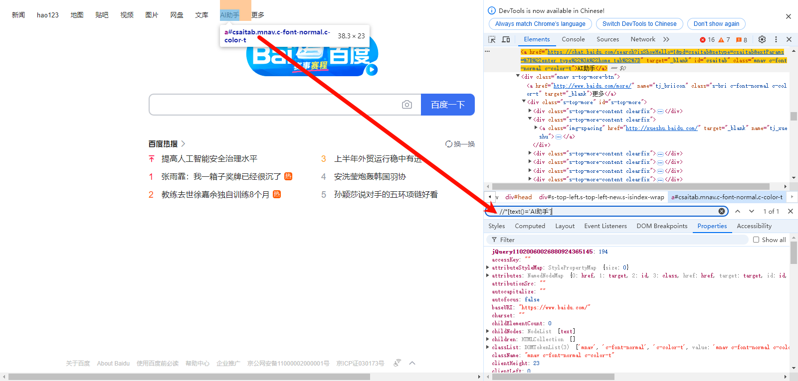
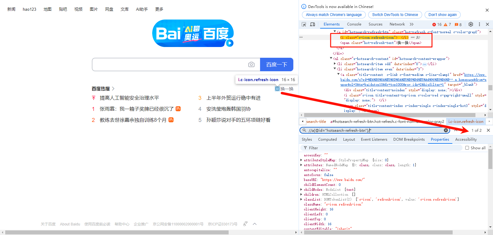
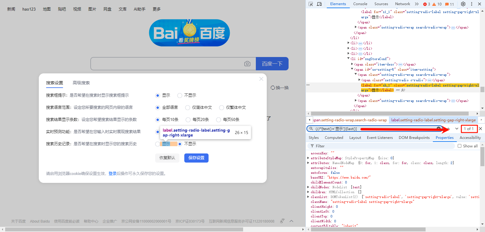

### 1. 手写好于复制

不要：右键Copy Xpath

要：手写 //input[@id="su"]

 

### 2. 尽量使用相对不变的属性定位，尽管没有哪个属性是永远不变的(包括id)

 

不要写：//div[@id="ui100000434_1"]

要写：//div[text()='我待完成的任务']

 

### 3. 看准Id是否可信

发版会变的id特征：一串数字、一串无意义的字母，如：//div[@id="ui100000434_1"]

唯一id特征：有意义的命名、开发声明了唯一，如：//input[@id="su"]

 

### 4. 利用星号解决标签变化内容不变的情况

 

div和span之间变化是最多的，使用*可以解决标签变内容不变的情况

常规写法：//div[text()='AI助手']

更稳定的写法： //*[text()='AI助手']

 

### 5. 内容较长时使用元素的部分值而不是完整的值

 

不要写：//span[text()='莫雷加德：决赛打得比对阵王楚钦时好']

优化为：//span[contains(text(), '莫雷加德')]

 

### 6. 找子节点

所有子：//a[@id="hotsearch-refresh-btn"]/*

指定子：//a[@id="hotsearch-refresh-btn"]/span

 

### 7. 找父节点

写法：parent::

例子：//*[text()='换一换']/parent::a

 

### 8. 找兄节点

写法：preceding-sibling::

例子：//*[text()='换一换']/preceding-sibling::i

 

### 9. 找弟节点

写法：following-sibling::

例子：//*[@class="c-icon refresh-icon"]/following-sibling::span

 

### 10. 往下查找

用法：following::

例子：//*[text()='不包括关键词']/following::input

 

 

### 11. 往上查找

 

用法：preceding::

例子：//*[text()='全部语言']/preceding::span[1]

 

### 12. 找祖先

用法：ancestor::

例子：//li[text()='搜索设置']/ancestor::ul

 

### 13. 索引-子节点索引

用法：第几个就写几，如上第四个索引，后面加[4]

例子：//ul[@class="s-hotsearch-content"]/li[4]

 

### 14. 索引-全范围索引

用法：取全范围索引，需要括起来再取索引

例子：(//*[text()='显示'])[2]

### 15. 最后一个

用法：last()

例子：(//*[text()='显示'])[last()]

 

### 16. 包含关系-属性

 

又一例子：//a[contains(@class,"s-bri")]

 

### 17. 逻辑关系

用法：and、or、!=、=、

例子：//div[@id="s-top-left"]/a[text()!='hao123']

 

### 18.矢量元素的特殊定位

 

不要写：//use[@xlink:href="#icon-bell"]，这样写定位不到

要写：//*[@*="#icon-bell"]

常见矢量元素？use、svg、g