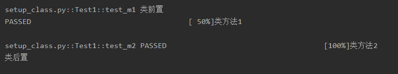

### 1.类的前后置setup_class/teardown_class

setup_class为类前置，在类前生效，teardown_class为类后置，在类后生效。

```python
class Test1:
    def setup_class(self):
        print("类前置")

    def teardown_class(self):
        print("类后置")

    def test_m1(self):
        print("类方法1")

    def test_m2(self):
        print("类方法2")

```

执行结果如下图所示，依次打印：类前置、类方法1、类方法2、类后置




### 2.类方法前后置setup_method/teardown_method

setup_method为类方法前置，在每个类方法前生效，teardown_method为类方法后置，在每个类方法后生效。

```python
class Test1:
    def setup_method(self):
        print("类方法前置")

    def teardown_method(self):
        print("类方法后置")

    def test_m1(self):
        print("类方法1")

    def test_m2(self):
        print("类方法2")
```

执行结果如下图所示，依次打印：类方法前置、类方法1、类方法后置、类方法前置、类方法2、类方法后置


### 3.模块前后置setup_module/teardown_module

setup_module为模块前置，在模块前生效，teardown_module为模块后置，在模块后生效。模块指的是py文件

```python
def setup_module():
    print("模块前置")


def teardown_module():
    print("模块后置")


class Test1:
    def test_m1(self):
        print("类方法1")


class Test2:
    def test_m3(self):
        print("类方法3")

```

执行结果如下图所示，依次打印：模块前置、类方法1、类方法3、模块后置


### 4.setup_function/teardown_function外部函数前后置

setup_function为外部函数前置，在每个函数前生效，teardown_function为函数后置，在每个函数后生效。

新手容易混淆setup_function和setup_method，记住setup_method是针对类里面的方法，setup_function是针对类外面的方法（正规叫法为函数）；setup_method在ecol的ui自动化中用得很多，setup_function用不上。

```python
def setup_function():
    print("函数前置")


def teardown_function():
    print("函数后置")


def test_1():
    print('函数1')


def test_2():
    print('函数2')
```

执行结果如下图所示，依次打印：函数前置、函数1、函数2、函数后置


### 5.setup/teardown动态表现

除了上述4种外，还有的写法为直接写setup/teardown，在类里表现为setup_method/teardown_method，在类外表现为setup_function/teardown_function。


### 6.跳过执行@pytest.mark.skip

如果某条用例不希望它执行，可以使用@pytest.mark.skip() 用在用例方法的上方，这样被它标定的用例就会跳过。

```python
import pytest


class Test1:
    def test_m1(self):
        print("类方法1")

    @pytest.mark.skip("跳过这个用例")
    def test_m2(self):
        print("类方法2")
```

执行结果如下，可以看到，类方法2未被执行。


### 7.参数化@pytest.mark.parametrize

参数化也叫数据驱动，用于用例不变但数据很多的场景，使用方式均类似，需要注意的是参数需要指定，复制一下代码去pycharm里体验一下吧

```python
import pytest


class Test1:
    @pytest.mark.parametrize("name", ['xial', 'xiaow'])
    def test_m2(self, name):
        print("名字", name)
```

运行结果如下，可以看到，传入的2个参数都被执行。


### 8.打标签@pytest.mark.标记名

给用例做标记，用于运行的时候，可以运行携带这个标记的用例。

如给上述用例做个冒烟的标记，再做一个特殊的标记

```python
import pytest


class Test1:
    @pytest.mark.smoke
    @pytest.mark.comerebi
    def test_m2(self, name):
        print("名字", name)
```

运行的时候就会只运行携带该标记的用例，运行指令如下：

```python
import pytest
pytest.main(["-m", "smoke"])
```

