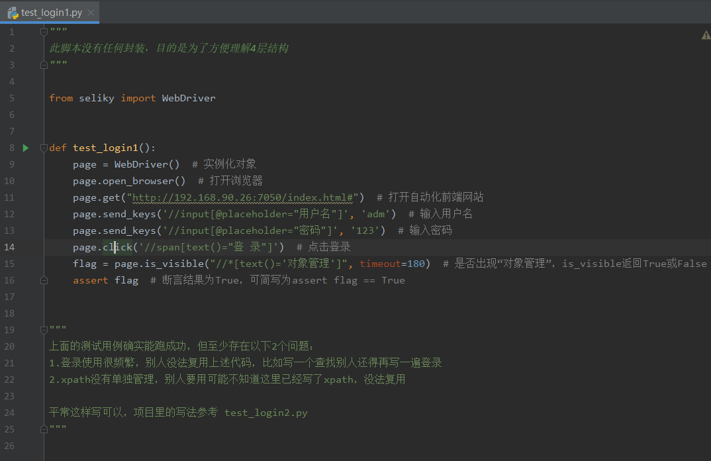
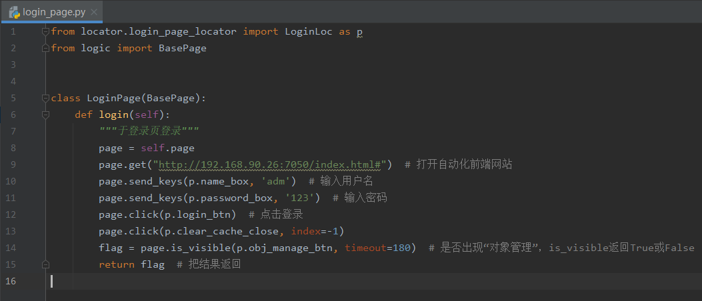
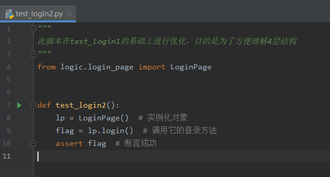

### 1.明白思想很重要

​	在过往公司、朋友、同事、网友等遇到最多的问题，是对自动化的脉络不够清晰，包括作者本人进入的几个公司，都花废了很长时间把自动化项目的结构梳理好。

​	要系统性地掌握自动化，是肯定要明白结构的，不然就像各写各的，代码千人千面的风格，肯定没法集成的。必须遵循一个思想、固定好风格、结构，自动化项目才能稳健前行。这方面测试同学应该向开发同学多学习。

​	这个思想在外界有不同的叫法，其内核仍然是以selenium等基础库拓展而来。如华为称之为aw（action word）；如以robotframework为基础框架的公司称之为关键字模式；还有更多的叫PO模式（page object，虽然这个模式的名字比内容更响亮）；还有八竿子打不着的数据驱动模式（想起来次会上听某个专家讲得神乎其神）；读者不必羡慕别人家的，万变不离其宗，主旨思想就那几个。测试里有很多同学容易听风是雨被那些专业名词忽悠得不清不楚，等终于明白的时候已经浪费了很多时间。

​	四层结构其实很简单，接下来我从数据流向的角度出发，一个一个拆解。

### 2.元素层

​	元素层是页面元素的汇合。一个页面有很多元素，如某个按钮，某个编辑框，都称之为元素。元素用xpath写出来后，把xpath保存在这个页面对应的元素类里即可。如下图所示。

​	可以看到，元素层在代码里表现为一个一个xpath。在有的公司，它表现为Element对象，即包裹了xpath等定位方式的元素对象。反映的都是页面对象，不同的是颗粒度不一样，xpath就是最小颗粒度，内存开销也比Element对象小。

​	元素层是 PO 模式的思想体现，page object（页面对象）可以是xpath，当然也可以是封装之后的Element对象。通过把页面对象单独管理，为的是方便复用。

### 3.Selenium封装层

​	几乎没有哪个有自动化的公司用原生selenium来进行ui自动化，至于为什么无需多言。selenium封装层是为了更好地与页面做交互用的，有了二次封装库，读者无需深入研究selenium（当然有时间也可以研究）。封装层的目的就是为了方便大多数写代码，毕竟大多数自动化测试员代码能力较弱，更不用说很多公司的做法是让功能测试来做自动化，那么一个好的封装层尤为重要。

​	市面上的selenium封装库有很多，如知名的helium、poium，读者可自行百度了解。

​	作者的二次封装库叫做seliky，seliky的介绍见后续链接，它的用法超级简单，用起来体现一个以人为本，以人为视角，有什么动作，调用对应的方法即可。作者——即我的目的就是希望测试员少写代码，甚至巴不得不写。

​	常用的动作如下，基本上用一遍就会了，90%的场景都可以通过下列动作来实现

- click—— 点击某个元素
- send_keys—— 输入框输入值
- is_visible—— 是否显示了某个元素
- get—— 请求某个页面地址

  当你熟悉用法后，写个登录难不倒你，你很容易就写出下列代码。完美~

### 4.逻辑层

​	逻辑层专注于对业务逻辑的实现。如果明白了selenium封装层，那么你自然知道业务逻辑需要去哪个页面、点击哪些按钮、输入什么值来一步一步操作的。因为这些逻辑操作同样具有高重复性，所以需要封装起来，为的是也是方便复用。

​	比如开启浏览器的逻辑、比如登录的逻辑、比如好几个页面有同样新建，这些操作基本一样，没必要写好几份代码，写一份代码封装起来，它们新建的时候调用封装的逻辑即可。（亲爱的读者原谅我的啰嗦，如果你是开发自然明白这个代理）

​	*tips：逻辑层与业务强相关，PO的思想很难约束到它，毕竟跨页面的逻辑数不胜数。等读者写熟练之后便会遇到一个问题，到底怎么写一个通用的逻辑方法？好像怎么写都差点意思？*

​	*答案只有一个：写的时候注释好从哪里开始到哪里结束。*

​	*肯定有很多读者不认可，认为熟悉业务了自然就知道怎么写，只有熟悉了业务才知道哪一块业务是干什么的，对应的逻辑也比较好拆分。道理不假，但与我的答案不冲突，相信我，当你写久了有他人接手时，没人愿意读你的代码，一个良好的注释胜过千言万语*

### 5.用例层

​	用例层专注于逻辑层调用、结果校验。

​	比如登录，调用登录的逻辑，断言登录成功即可。

​	为什么没有写封装层的代码？因为封装层是已经写好的库——seliky，只需要了解在逻辑层里如何调用即可。对于很多自动化不成熟的公司来说，该层是需要的。

​	需要注意的是，用例层的文件名、类名、方法名命名规则会受pytest.ini配置文件控制。

​	明白了这四个层级结构，写用例就很轻松了，下一章节通过3个demo进行演示。