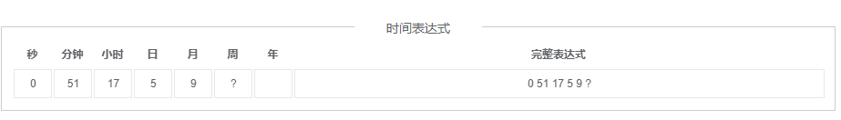

# 平台化方案-自研

## 一、方案介绍

> 此方案是基于UI自动化框架实现的自动化测试平台，有别于传统的自动化测试平台，它在框架和平台之间找到了一个平衡点，通过可视化的方式来管控ui自动化用例、跑冒烟、定时任务、出报告等，同时又不影响测试员写代码。
>
> - 对于自动化测试人员：通过seliky的相关规范编写UI自动化用例即可。
> - 对于管理人员：通过该测试平台管理和执行测试用例，创建任务等。
>
> 此方案可以在大多数公司自研的devops平台上当作需求进行开发。

## 二、用例管理


**说明：用例管理界面主功能包括数结构、用例展示、运行用例、查看报告、选择用例**

1. #### ui自动化专栏

   1. 在左侧列表加一个 “ui自动化“ 专栏
   2. 点击后展示右侧-**用例管理 界面**

1. #### 项目下拉框

   1. 点击后展示拉取的项目名，例如：DOT-UiAutotest
   2. 拉取过的项目展示在下拉列表
   3. 项目管理详情见第五节-项目管理

   

1. #### 项目结构目录

   1. ui自动化项目内部是统一的结构，““全部模块”” 对应项目里的test_case目录，目录分为2级，第一级为test_case目录下的文件夹名称，第二级为指定文件夹下面的py文件名称，参考编辑器界面

   

1. #### 用例展示（解析py）

   

   1. ID：为唯一递增序列，拖动ID可以滚动排序
   2. 测试用例：为测试用例名称，在py文件内部为小写test开头
   3. 测试用例描述：为测试用例的描述，在py内部为小写test开头的方法的注释
   4. 状态：枚举值为：成功、失败、进行中
   5. 操作：
      1. 运行：
         1. 点击运行，状态为进行中；对应接口幂等
         2.  后端执行某用例的指令为：pytest 文件名::类名::方法名，例如：
            1. ```Bash
               cd testcase
               pytest test_demo.py::TestDemo2::test_demo
               ```
      2.  查看：查看最近一次运行完毕的测试报告，若无，提示 “该用例暂无测试报告，请执行后查看“

1. #### 搜索用例

   

   1. ID、名称、描述均能搜索到

## 三、任务管理


1. #### 创建任务

   1. 点击创建任务，出现弹窗

   暂时无法在飞书文档外展示此内容

   1. 任务名：15个字内，仅限中英文-_，重名校验
   2. 定时配置：底层实现参考crontab定时任务，placeholder类似图中即可
   3. 问号：提供一则crontab的指导，可参考
      1. 
   4. 保存：点击保存后，在**3-任务管理**界面要有该条任务

1. #### 批量运行

   1. 多用例运行指令与单用例运行指令类似，参考：

    `pytest test_demo.py::TestDemo2::test_demo test_demo.py::TestDemo2::test_demo2`

   1. 批量运行完后的报告要在 **4-测试报告** 里展示
   2. 里面的每一个用例点击 **查看** 都能看到该报告

1. #### 任务管理界面

   1. ####  新建界面

   2. 这里的操作为填写任务名，选择用例，点保存，界面参考如下：

      

   1. 运行：这里的运行逻辑和上面的批量运行逻辑一致
   2. 编辑：进入任务详情界面，界面类似新建的界面，要能对用例进行添加删除
   3. 删除：点击删除，该任务就删掉了

## 四、测试报告

**说明：在用例管理界面每次运行完都会生成报告，运行的报告要在这里存起来**


1. #### 报告详情

   1. 报告名称：为用例/测试集的名称
   2. 对应的html生成时间。每一次执行后，测试报告已经生成好了，最新报告对应的文件路径为：项目名/output/report/report.html
   3. 最新报告

   

   1. 并行情况：若同时运行多个用例，后端是否能找到对应的哪个报告？
      1. 方案一：已知最新报告在report文件夹，历史报告为report_092515文件夹，_后面的为 月日时分秒毫秒，最新报告除了在report文件夹也会在最近的历史报告文件夹里。运行完之后可以根据最接近运行时间的报告来找
      2. 方案二：已知无论运行成功失败与否，都会生成报告，只要执行就有报告，故可以根据次数来对应报告。

1. #### 查看

   1. 点击查看，即打开report.html，即跳转至报告界面

   

1. #### 删除

   1. 提示是否删除，是-界面不再展示该条数据

   

## 五、项目管理

**说明：由于可能有多个UI自动化项目，故主功能包括切换项目、项目的拉取、删除、编辑、展示**

1. #### 入口

   1. 点击项目管理，进入项目管理界面（或弹窗）


1. #### 项目管理新建编辑删除

   1. 参考如下


1. 删除：点击删除，弹窗 “确定删除项目...吗？”，点击确定，删除该项目。
2. 编辑，弹窗与新建类似，如下
3. 点击创建项目后弹窗参考如下


## 六. 环境管理


**说明：开发环境也能用的需求。环境差异归根结底是配置、数据、页面展示等不同，要实现其它环境也能用，有2个方案。**

1. 方案1：其它环境不用变，基于其它环境写用例。
2. 方案2：其它环境同步已有环境的配置、数据等，无需再写用例。

**方案a较为简单，以下介绍的是方案b。**

1. #### 创建环境


环境同步：默认无，下拉框列表里展示已有环境的环境名，选择环境后，将该环境的配置、数据同步至要新建的环境。

1. #### 展示、编辑、删除环境

编辑逻辑类似新建，删除逻辑删除即可，展示环境如上图环境列表。

## 七. 误区

- 误区1-带参数运行：一个合格的用例本身能做到无限次重复执行且不污染环境。引入外部参数可能会造成 参数重复导致运行失败、运行成功后清理数据 等问题。所以该功能虽然可以做但有待商榷。

在用例运行按钮的右侧加一个带参运行，弹出下方弹窗，将测试用例里的参数解析出来，填入参数值后，点击“带参数运行”即运行。


- 误区2-一套用例可以跑多个环境，除非环境同步，没有别的办法。
- 误区3-认为有了自动化便能取消功能测试。


# 平台化方案-集成开源平台

## 一. 为什么选Metersphere

​	作者十几年深耕于自动化、测试开发等领域，直至各种AI工具大行其道的2025年，要论平台化，作者只推荐metersphere。如果你认为有超越metersphere的工具，敬请提出issue。

## 二. 部署metersphere

​	去ms官方按照教程部署即可。https://metersphere.io/docs/v2.x/quick_start/quick_start/#1

## 三. 做二次开发

​	在开始作者提到，metersphere的ui自动化很难用，最好是替换底层ui交互库为seliky，强强结合，岂不美哉~

​	由于项目经常变化，修改哪些文件请读者自行搜索。全局搜索 “click”、“send_keys” 等字样即能确定文件位置，最好由懂自动化测试的后端开发来进行调整。