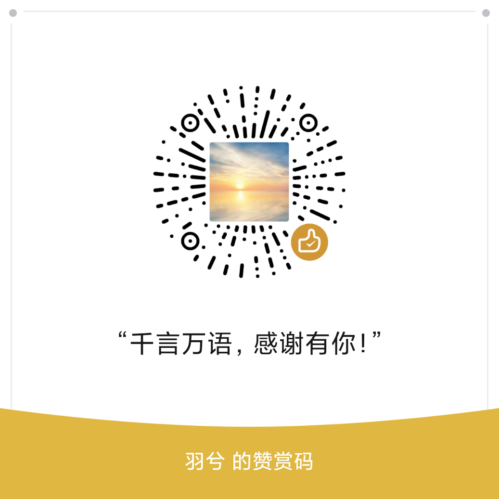

pytest官网：https://docs.pytest.org/en/stable/

selenium官网：https://www.selenium.dev/zh-cn/

seliky官网：https://gitee.com/teark/seliky

conftestpy官网：https://gitee.com/teark/conftest

​	如果读者对seliky有更好的想法或提议可以告诉我。如果需要对seliky、conftestpy二次魔改，加作者微信，可以让你少走弯路。

作者联系方式：

少侠别走~，请作者喝一杯呗~

